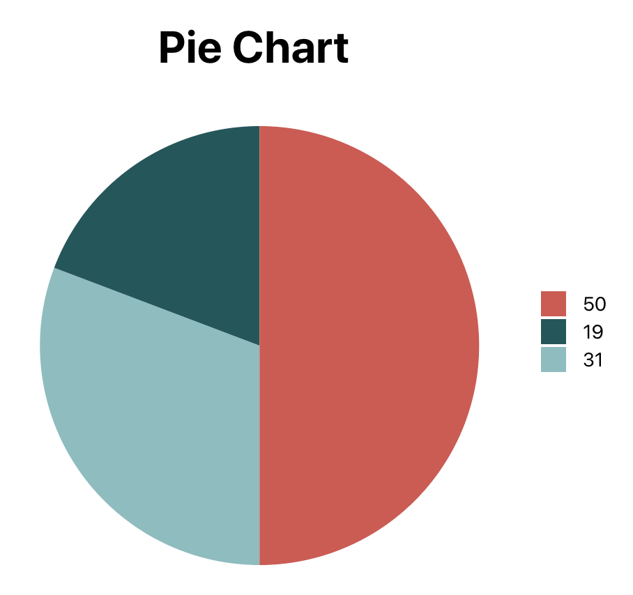
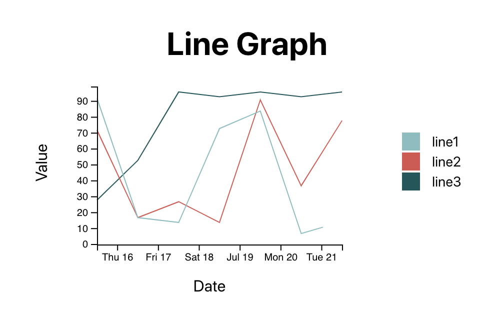

## Starter project for react and D3

After cloning run:   
   
```npm install```

```npm start```

To Run with docker:

```docker build -t d3-react-template .```

```docker run -p 3000:80 d3-react-template```  <br/>
<br/>


### Example Charts


<br/>

